# Trinethra – Supervisor Feedback Analyzer


Trinethra is a powerful developer‑tool and audit utility that automatically evaluates organizational or operational transcripts – such as performance reviews, 1‑on‑1 supervisor discussions, and candidate evaluations. By analysing conversational transcripts against structured 1‑10 performance rubrics, assessment dimensions, and KPIs, Trinethra extracts key signals, highlights systematic gaps, and generates actionable insights.

---

## ✨ Key Features

- **Automated Rubric Scoring** – Map transcript content to a 1‑10 performance scale.
- **KPI Mapping** – Identify behaviours that align with or deviate from defined KPIs.
- **Gap Analysis** – Surface systemic issues across multiple conversations.
- **Actionable Follow‑up Questions** – Suggest probing questions for deeper insight.
- **Local LLM Powered** – Runs entirely on your machine via Ollama (`llama3.2`).
- **Extensible Architecture** – Plug‑in custom rubrics or LLM back‑ends.

---

## 🏗️ Architecture Overview

The system is built on a decoupled, three-tier architecture that ensures responsive UI updates while handling slow, compute-intensive LLM inference in the background.

```mermaid
sequenceDiagram
    participant User
    participant UI as React Frontend (Port 3000)
    participant API as Node.js Backend (Port 5001)
    participant LLM as Ollama / Llama 3.2 (Port 11434)

    User->>UI: Submit Supervisor Transcript
    UI->>API: POST /api/analyze { transcript }
    
    rect rgb(20, 40, 60)
        Note right of API: Data Processing Pipeline
        API->>API: 1. Build context-aware prompt
    end

    API->>LLM: POST /api/generate { prompt }
    LLM-->>API: Raw JSON string (Markdown enclosed)
    
    rect rgb(20, 40, 60)
        Note right of API: Recovery & Validation
        API->>API: 2. cleanLLMResponse() (strip markdown/backticks)
        API->>API: 3. JSON.parse(cleanedText)
    end
    
    alt JSON parsing succeeds
        API-->>UI: 200 OK (Structured JSON)
    else JSON parsing fails
        API->>LLM: Retry generation (max 2 attempts)
        LLM-->>API: New Raw JSON string
        API-->>UI: 200 OK or 500 Error
    end
    
    UI-->>User: Render interactive dashboard components
```



### Technical Components

1. **Presentation Layer (Frontend)**
   - Built with **React** and standard CSS (no heavy UI frameworks) for high performance.
   - Designed with an immutable local state: the transcript area becomes read-only upon submission to ensure the visualised analysis accurately maps to the exact text provided.
   - Modular component structure (`ScoreCard`, `EvidenceList`, `GapAnalysis`, etc.) processing nested JSON responses.

2. **Application Layer (Backend)**
   - A lightweight **Express / Node.js** service that handles prompt engineering and sanitisation.
   - **Fault-Tolerant Parsing**: LLMs frequently inject conversational text or markdown fences (e.g., ` ```json `) into JSON endpoints. The backend uses targeted regex cleaning and automatic retry loops to guarantee valid JSON before sending it back to the client.
   - **Timeouts & Scalability**: Specifically tuned to handle long-running LLM inferences (up to 10 minutes) without dropping the HTTP connection, accommodating slow CPU-bound generation on CI or older hardware.

3. **Inference Layer (Local LLM)**
   - Powered by **Ollama** running the `llama3.2` model.
   - Kept strictly local to guarantee data privacy for sensitive internal HR and performance review transcripts. 

4. **CI/CD Pipeline**
   - GitHub Actions workflow spins up a sidecar Ollama Docker container, pulls the model dynamically, and executes Jest integration tests to validate the full stack in an isolated environment.

## ⚙️ Setup Instructions

> **Prerequisite:** Node.js (v20+) and **Ollama** installed on your machine.

### 1️⃣ Install Ollama & Pull Model
```bash
# Install Ollama from https://ollama.com/
# After installation, start the UI or run the daemon
ollama pull llama3.2
```

### 2️⃣ Backend
```bash
cd backend
npm install
# Start the server (ensure a "start" script exists in package.json)
npm start
# Or manually: node server.js
```

The backend will listen on **http://localhost:5001**.

### 3️⃣ Frontend
```bash
cd frontend
npm install
npm start
```

Open **http://localhost:3000** in your browser to access the Trinethra UI.

---

## 🚀 Usage Workflow

1. **Paste a transcript** into the large text area.
2. Click **"Analyze"** – the UI sends the raw text to the backend.
3. The backend builds a prompt, calls Ollama, and parses the JSON response.
4. Results are rendered as:
   - Numeric rubric scores
   - Highlighted evidence snippets
   - KPI heat‑map
   - Gap‑identification list
   - Suggested follow‑up questions

---

## 🛠️ Design Challenges Solved

- **Robust JSON Parsing** – Custom regex scrubbing removes markdown fences and stray text before `JSON.parse`.
- **Automatic Retry Logic** – Backend retries a failed LLM call once to mitigate transient parsing errors.
- **Error Transparency** – Detailed error messages surface when parsing repeatedly fails, guiding the user to adjust transcript length.

---

## 📦 Future Improvements (Roadmap)

- Prompt tuning & few‑shot learning for higher consistency.
- Streaming file uploads (PDF, SRT, audio) to handle larger transcripts.
- Persistent storage (MongoDB / PostgreSQL) for historical reports.
- Comprehensive test suite (Jest, Supertest, React Testing Library).

---

## 🤝 Contributing

Contributions are welcome! Please:
1. Fork the repository.
2. Create a feature branch (`git checkout -b feat/awesome‑feature`).
3. Ensure linting passes (`npm run lint`).
4. Open a Pull Request describing the changes.

---

## 📄 License

Distributed under the **MIT License**. See `LICENSE` for more information.

---

*This README is auto‑generated by the Trinethra assistant to showcase best practices.*
