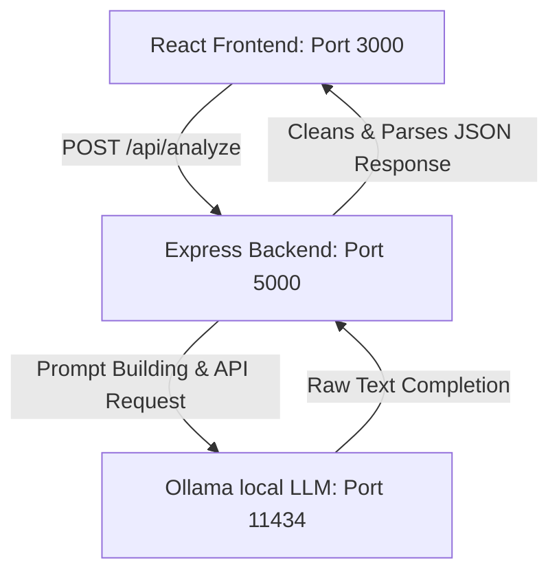

# Trinethra — Supervisor Feedback Analyzer

Trinethra is a developer tool and auditor utility designed to evaluate organizational or operational transcripts (such as performance reviews, 1-on-1 supervisor discussions, and candidate evaluations). By analyzing these conversational transcripts against structured 1-10 performance rubrics, assessment dimensions, and KPIs, Trinethra automatically parses key signals and identifies systemic gaps.

---

## Architecture Overview

Trinethra runs a three-tier system:



- **Frontend (Port 3000)**: Built on React (using Create-React-App). Provides an interactive, dark-themed dashboard to paste transcripts, view numeric scores, study highlighted evidence, map KPI behaviors, explore gap analyses, and review follow-up pointer questions.
- **Backend (Port 5000)**: Express server that manages prompts and routes requests to the LLM. It features robust markdown-stripping code, JSON cleaning mechanisms, and automatic query retries to ensure response integrity.
- **Local LLM (Port 11434)**: Serves a local instance of Ollama running `llama3.2` to process high-fidelity assessments.

---

## Setup Instructions

Ensure you have [Node.js](https://nodejs.org/) installed on your machine.

### 1. Set Up Ollama
1. Download and install [Ollama](https://ollama.com/).
2. Start the Ollama application.
3. Open your terminal and pull the local model:
   ```bash
   ollama pull llama3.2
   ```

### 2. Run the Backend
1. From the `trinethra` root directory, navigate to `backend/`:
   ```bash
   cd backend
   ```
2. Install dependencies:
   ```bash
   npm install
   ```
3. Start the Express server:
   ```bash
   npm start
   ```
   *(Note: Ensure `backend/package.json` has a start script pointing to `server.js` or start it manually with `node server.js`)*

### 3. Run the Frontend
1. Open a new terminal window and navigate to the `frontend/` directory from the root:
   ```bash
   cd frontend
   ```
2. Start the React development server:
   ```bash
   npm start
   ```
3. Open [http://localhost:3000](http://localhost:3000) in your browser to interact with the UI.

---

## Design Challenges Tackled

### 1. Robust Structured JSON Parsing
LLMs are conversational by nature and frequently decorate their JSON outputs with conversational prefixes, markdown code fences (e.g., \`\`\`json), or tailing notes. This breaks native `JSON.parse` operations in Javascript.
- **Solution**: Implemented custom regular expressions and string scrubbing algorithms inside the Express route to cleanly slice away formatting backticks and identify raw JSON bounds.

### 2. Fault Tolerance (Automatic Retry)
Sometimes, local models (like `llama3.2` on resource-constrained host machines) return corrupted JSON structures or ignore output parameters during peak utilization.
- **Solution**: Configured a retry loop in the `analyze` endpoint. If parsing fails, the backend automatically performs a second call to Ollama before returning a HTTP 500 error, significantly increasing operation success rates.

---

## What I Would Improve With More Time

1. **Prompt Tuning & Few-Shot Learning**: Introduce detailed few-shot examples (JSON templates) within the LLM prompt to decrease JSON structure divergence.
2. **Context Window Expansion**: Transition from string-based input to streaming file uploads (supporting PDFs, SRTs, and audio logs) to accommodate larger transcripts.
3. **Database Integration**: Add persistent storage (e.g., MongoDB, PostgreSQL, or SQLite) to save past reports and track performance trajectories over time.
4. **Comprehensive Test Suite**: Implement unit tests (using Jest/Supertest) for the backend prompt construction, and component testing (using React Testing Library) for the dashboards.
